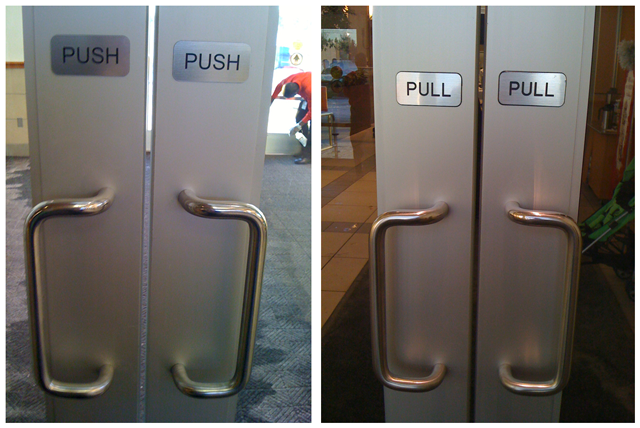
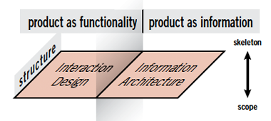

# Lesson 04: Mapping Workflow Part I &ndash; The User Experience

## Overview

Modules 04 and 05 walk us through a typical web mapping process from start to finish. The goal is not to delineate the specific techniques one would always follow for making a web map, but rather to think through the data, design, and development processes at a more conceptual level. We want to highlight the points when design decisions are made and then about how to implement them technically when we build our web map.

<!-- TOC -->

- [Lesson 04: Mapping Workflow Part I &ndash; The User Experience](#lesson-04-mapping-workflow-part-i-ndash-the-user-experience)
    - [Overview](#overview)
    - [The user experience](#the-user-experience)
        - [User-centered design](#user-centered-design)
        - [Personas and scenarios](#personas-and-scenarios)
        - [The elements of the user experience](#the-elements-of-the-user-experience)
    - [The strategy plane: product objectives and user needs](#the-strategy-plane-product-objectives-and-user-needs)
    - [The scope plane: functional specifications and content requirements](#the-scope-plane-functional-specifications-and-content-requirements)
        - [Step 1: Access the data](#step-1-access-the-data)
        - [Step 2: Data wrangling and preparation](#step-2-data-wrangling-and-preparation)
            - [Use find and replace](#use-find-and-replace)
            - [QGIS: Database pivot table operation](#qgis-database-pivot-table-operation)
        - [Step 3: Save the modified CSV file (1 pts)](#step-3-save-the-modified-csv-file-1-pts)
    - [Developing content requirements and functional specifications of a map](#developing-content-requirements-and-functional-specifications-of-a-map)
    - [The structure plane: interaction design and information architecture](#the-structure-plane-interaction-design-and-information-architecture)
        - [Developing a wireframe mockup and paper prototyping](#developing-a-wireframe-mockup-and-paper-prototyping)
    - [Addendum: Pivot table methods in spreadsheets](#addendum-pivot-table-methods-in-spreadsheets)
        - [Wrangling in Open Office Calc](#wrangling-in-open-office-calc)
        - [Wrangling in Excel](#wrangling-in-excel)
    - [Additional Reading and Resources](#additional-reading-and-resources)

<!-- /TOC -->

## The user experience

So far, within the New Maps curriculum, we've been focused on some foundational principles of cartography and GIS (MAP671) and building the HTML/CSS/JavaScript skills (MAP672) needed for web map design and development. This lesson introduces some higher-order design strategies for approaching a web mapping project.

What follows falls under the fields of **user-centered design**, **usability engineering**, **user experience**, and **human-computer interaction**. These are all big fields, with lots of literature (some references are provided at the end of this lesson). We're going to give you a general sense of these design strategies and how they are applied uniquely throughout a mapping process.

Keep in mind that, in addition to helping you make an effective interactive map, these practices are good "buzz words" to use when applying for jobs and speaking with potential clients/employers. If you're asked a question like, "How would you begin to code a map that does X, Y, or Z?", declaring variables and writing functions may not be the best first answer. Demonstrating that you have a broader sense of an application's design process will go a long way.

### User-centered design

**User-centered Design (UCD)**, also known as taking a **user-centered perspective**, is an approach to interface design and development that places an early and active focus on the needs of the user. This focus may seem obvious to some of us (and after you build products and design maps for clients long enough, it will become second nature). Of course, you want to design your map, so the intended user finds it easy, intuitive, and fun to use!!! Right? Who would argue against this?

Surprisingly, many things in the world, both analog and digital, are NOT well-designed with the experience of the user in mind. Particularly, engineers and programmers coming out of Computer Science programs tend to build robust application interfaces that, though maybe impressive in terms of the coding efficiency (with a plethora of functionality), are overly complex and not well-designed visually. Users may have a hard time using them, or it may take a long time to figure out how to access certain functionality. GIS systems like ArcGIS and QGIS may still characterize this overly-complex interface design. Yet this attention to "usability" extends to all designed things in our built environment.

A classic book in this regard is *The Design of Everyday Things* (1998), by Donald Norman. Within the book Norman writes about encountering "frustrations of everyday life":

> If I were placed in the cockpit of a modern jetliner, my inability to perform gracefully and smoothly would neither surprise nor bother me. But I shouldn't have trouble with doors and switches, water faucets and stoves. "Doors?" I can hear the reader saying, "you have trouble opening doors?" Yes. I push doors that are meant to be pulled, pull doors that should be pushed, and walk into doors that should be slid. [ ... ] A door poses only two essential questions: In which direction does it move? On which side should one work it? The answers should be given by the design, without any need for words or symbols, certainly without any need for trial and error.

When Norman writes of the "psychology of everyday things," he talks of how people often blame themselves when they encounter elements of their built environment, they do not understand how to use. They take the blame, even though, as Norman argues, it's a poor design that's at fault. Consider a classic example; when you approach these doors, why are these signs indicating "push" or "pull" required? What does the design of the door handles tell you to do? What is your "call to action" in this case, to push or to pull?

  
*Classic problem of poor door design.*

The handle design invites an action to pull it. Imagine if you didn't read the sign, or couldn't! The signs to "pull" on the doors to the right aren't necessary. That handle design tells you to pull it open instinctually. Evidently, whoever installed the doors on the left did so incorrectly. If those doors require a push to open, there should be a push plate there, instead of a pull handle.

Even worse are the clear swinging glass doors that only open toward one direction. As you approach, you are unclear about what action you should take. You're forced to try one. You may get it right, or you may fail.

Of course, design solutions can get even worse:

  
*Intentionally ambiguous design.*

Another case of poor door design is the push bar on the top door below. Its design indicates that it should be pushed, but on which side? The door will only swing open one direction, so inevitably, a user will push on both ends to determine this. The push handle design on the bottom is an improvement: it offers the same functionality as the one on top, but it indicates that the door hinges are on the left.

  
*Bar indicates to push, but which side? Lower is an improvement.*

While Norman explores similar examples from daily living, we can apply this way of thinking to the design of a digital interface as well. We spend a lot of time working with the data, struggling to get our code error-free, learning how to put an interface widget on the map, and fire a function when the user changes its value. But often we lose sight of how that interface may be used by someone who hasn't built the map. We forget about the user experience itself, which should always remain present as we design and develop.

Consider some of the maps we've already made through the courses. When we place a simple marker or circle on a map, why does a user try to click this feature?  How do they know about the map's functionality? They may have experience using Leaflet maps, and therefore test. Or, perhaps we change the color of the marker slightly when the user mouses over the marker, giving them an indication that further interaction is possible. This small example of offering the user an "affordance" illustrates a UCD perspective.

Remember that we may become great programmers and write beautiful, optimized code underlying our maps. We may design complex interfaces that offer dozens of different features for filtering, re-expressing, re-symbolizing, and exploring our data. But if users are unsure of how to interact with the interface, they may become confused and run out of patience using it.

The following graphic illustrates two competing tensions that influence whether an interface design is successful. While it is in part due to the **level of complexity** (the higher the complexity, the greater the chance of interface failure), the **user's expertise and motivation** also enters into how the interface is used. Having a sense of your user's experience using similar interfaces and their motivation to learn the system will help you make critical design decisions.

  
*User motivation vs. Interface Complexity, from (2008) Roth and Harrower.*

Other than Donald Norman, the other name you should know concerning usability engineering and UCD is Jacob Nielsen (Ph.D. in human-computer interaction), who, along with Norman, formed the [Nielsen Norman Group](https://www.nngroup.com/). Their company provides empirically-based advice and consulting for improving the usability of information design. Their research informs such resources as [usability.gov](https://www.usability.gov/), which contains detailed guidelines for the UCD process and improving the utility of interfaces. The usability website is worth perusing as it offers a valuable resource when considering the various solutions for a given design problem.

### Personas and scenarios

While more robust processes using UCD  bring the target user through the mapping design and development phases from the beginning, another less intensive approach is to develop what is known as a **persona** of the user, which is an abstracted but specific description of the intended user. Often the use of a persona is coupled with a **scenario**, a detailed story of how the user will engage with the interface. A scenario may sound something like:

>Tom is curious about cancer rates across America.  He sees the broader pattern of the data displayed as a choropleth map. He becomes concerned about the high rates in his state of Kentucky and then zooms in to obtain more detailed information about Kentucky counties, which will appear within an info window when hovering over specific counties. He then is curious to see how these rates have changed over time. A time slider available on the edge of the map allows him to sequence through temporal data.

Personas and scenarios may go beyond merely detailing the functionality or steps of a system to consider the motivations and emotions of the user.

One of the more influential people to make use of personas and scenarios is Alan Cooper. In his book, *The Inmates are Running the Asylum* (2004), Cooper writes that traditionally UI design questions were left to programmers, who were not trained in design and often built software application interfaces that were painful and difficult to use. To help solve this, he advocates using personas and scenarios to develop what he dubs **goal-directed design**, a subset of user-centered design that organizes design and development processes in terms of how decisions ultimately meet the goals of the user.

### The elements of the user experience

Both the Nielson Norman group's Usability Engineering/HCI approach and Cooper's personas/scenarios approach offer guidance for achieving successful interface design. Ultimately, both are interested in improving the user's experience (UX). While both may make perfect sense in the abstract, following a USD lifecycle or creating a persona may not yield the desired results. It's probably best to be aware of these strategies, and to think of them as suggestions, you should blend with your own experience and design sensibilities as they continue to grow.

To that end, we'll introduce one additional but related approach: that of writer/designer Jesse James Garrett,  a founder of [Adaptive Path](http://www.adaptivepath.com/), a user experience consultancy based in San Francisco. Garrett's insights are most notably captured in his 2011 book titled *The Elements of the User Experience*. Like the other approaches described above, Garrett too recognizes the importance of taking the user's experience into account at every step of the process. However, the implications of this are complex and made more simple by breaking down the user experience design process into its principle components. To this end, he offers five planes, the **elements of the user experience**, which are placed on a continuum of more abstract to more concrete.

  
*Garrett's elements of the user experience.*

Garrett extends his abstract–concrete continuum of user experience elements to address a "basic duality" between a product as functionality and one as information.  As he writes:

>When the Web user experience community started to form, its
members spoke two different languages. One group saw every problem
as an application design problem, and applied problem-solving
approaches from the traditional desktop and mainframe software
worlds. (These, in turn, were rooted in common practices applied
to creating all kinds of products, from cars to running shoes.) The
other group saw the Web in terms of information distribution and
retrieval, and applied problem-solving approaches from the traditional
worlds of publishing, media, and information science.

Rather than pick one over the other, Garrett offers a further modification to his elements in which both functional and informational elements play a role on each plane of the elements' scope.

  
*Garrett's elements of the user experience addressing the product function duality.*

As we move forward through this lesson, we'll explore these elements of the user experience and apply them to a mapping workflow seeking to create a map of Kenyan education. However, these planes should not be viewed with firm edges. One does not completely finish the goals of the strategy plane before moving on the scope plane. Design is an interactive process, but these elements can provide a structure and direction for moving through a project.

## The strategy plane: product objectives and user needs

For this lesson, our mapping scenario is as follows: The Kenyan government has invested in their education system, and they are proud of the equal rates of boys and girls attending primary school. They are interested in knowing more about the attrition rates of boys and girls as they progress through school, and they (the "stakeholders") would like to see the data they've collected on a map to help visualize this.

We've been hired by the Kenyan government to make a map with data they've provided through the [Kenya Open Data Portal](http://www.opendata.go.ke/) portal. Note that the Kenyan government has an impressive collection of clean open data (though of course, we should always be asking critical questions as to the quality and selectiveness of the data)!

We've been directed to download data of Kenyan enrollment across primary schools (grades 1 - 8) for the year 2014: [National Boys and Girls Enrollments numbers per Class for Primary School](https://www.opendata.go.ke/datasets/national-boys-and-girls-enrollments-per-class-for-primary-school-education).

While it's tempting to immediately grab the data and work on getting it loaded into a map, let's first consider our design strategy and ask the most general question, "Why are we making this product?"

  
*Strategy Plane.*

As Garrett writes,

>The most common reason for the failure of a Web site is not technology. It’s not user experience either. Web sites most often fail because—before the first line of code was written, the first pixel was pushed, or the first server was installed—nobody bothered to answer two very basic questions:
>
>1. What do we want to get out of this product?
>2. What do our users want to get out of it?

Our first step is then to answer these two questions.

What we as mappers want to get out of this product is an intuitive interface that visually represents the data in a meaningful way and allows for interaction with which the data can be explored.

Since we're not actually dealing directly with the Kenya government, we'll need to make up the answers by anticipating who the stakeholders or "clients" are and what they want (i.e., create a persona/scenario). For this case, let's say we've determined that the user wants to:

1. see the spatial distribution of boys and girls enrollment rates across the Kenyan counties for a given grade
2. be able to visually compare boys and girls enrollment rates across these schools for a given grade
3. see any changes in this distribution through the grade levels (i.e., how do rates change as students progress through the grades?)

These are specific answers, and we could widen our thinking in terms of why we want to make the product to include such goals as:

1. to make better, more equitable decisions about allocating educational resources
2. to feel national pride at achieving equity in gender representation across the country
3. to better understand spatio-temporal patterns in grade-level enrollment, particularly when students move from primary to middle school.

There are several ways we could think about achieving these goals. For that, we'll move on to the next plane.

## The scope plane: functional specifications and content requirements

The scope plane allows us to get more concrete than the strategy plane. Moving beyond the question of why we're making the map, we're now ready to answer the question, "What are we going to make?"

  
*Scope Plane.*

Garrett writes,

>Strategy becomes scope when you translate user needs and product objectives into specific requirements for what content and functionality the product will offer to users.

We want to think about this both in terms of functional specifications and content requirements. While these are conceptually split within the functionality/information dualism posed by Garrett, in practice they influence each other. As mappers, it may be better to let the content drive the functionality. This echoes a broader ["content-first" approach](https://gathercontent.com/blog/designing-content-first-for-a-better-ux) within general web UX/UI design. Let's begin with the "content" of our application, which will be a cartographic representation of the data itself.

### Step 1: Access the data

Find the 2014 dataset, the National Boys and Girls Enrollments numbers per Class for Primary School, in our [assignment/data](assignment/data/) folder. This dataset was downloaded at [National Boys and Girls Enrollments numbers per Class for Primary School](https://www.opendata.go.ke/datasets/national-boys-and-girls-enrollments-per-class-for-primary-school-education). In any mapping project, it's a good idea to get a sense of the data availability and quality early on in the process.

Beyond our need to determine the product scope's specific requirements, it's advisable not to move forward on a mapping project until you're sure the necessary data is available. Clients can be notorious about wanting you to move ahead using placeholder data until the real information is gathered. This workflow is a recipe for disaster (and a user-experience failure).

We can see the data portal displays the data for us in the web page itself:

  
*National Boys and Girls Enrollments numbers per Class for Primary School in the web page.*

Take note of the structure of the data:

1. records are organized so each row contains the number of students for either boys or girls, for a particular grade level, aggregated to the county level
2. county centroids are provided (that's handy, but not quite the right format for us to use within a GeoJSON-based mapping environment)

One important question we as mappers should consider when asking, "What are we going to make?" is "Do we really need to make a map?" There is a lot of interest in making maps and seeing data in a geospatial form. But always remember that sometimes a simple bar chart or graph may be more useful for reaching the user's goals.

A more fundamental question when it comes to what we will make is, "Is the data geospatial?" Not all interesting data have a geospatial signature, or it may be costly or impractical to discover what this is.

While in some cases we may need to write a script to scrape these data from the web page (or email the administrator and ask for a digital copy), this portal allows us to download the data in a variety of static formats (e.g., CSV, JSON, PDF). We may want to download a few different formats to compare them, as we begin to anticipate our needs to process the data further. For now, let's download the CSV version.

Let's use our code editor first to inspect the data (though you may prefer to use Microsoft Excel or Open Office). For now, simply open up the data file to inspect it's contents and structure. 

  
*National Boys and Girls Enrollments numbers per Class for Primary School opened as a CSV in VS Code with the [Rainbow CSV](https://marketplace.visualstudio.com/items?itemName=mechatroner.rainbow-csv) extension*

Scanning through the data, we see there are records for each county for each grade for boys and girls. However, the format of the data will need some work in preparation for loading into our web map. Remember this: the best way to format a CSV data file is to have one row for every mapped feature (in this case counties) and a column for every feature attribute value. Currently, there are multiple rows for every county feature. So we'll need to fix that, and clean up the data a bit while we do.

### Step 2: Data wrangling and preparation

Knowing how to use a code editor and database program is very useful in data wrangling and web mapping. We want to clean the data by removing unnecessary fields and reformatting its structure. Again, this is an information architecture question, and knowing how we want that data to be structured within our script will help us prepare the data now. Drawing from previous maps using Leaflet, we know that:

1. the data will be encoded in a JSON or GeoJSON format
2. these data will consist of a single feature for each geographic unit
3. each feature will also contain the data attributes  

We, therefore, want to re-organize this CSV data so that:

1. each row is a record for a single Kenyan county
2. the data attributes are encoded in separate columns including:
    * the latitude of the county centroid
    * the longitude of the county centroid
    * the number of boys in grade 1
    * the number of girls in grade 1
    * the number of boys in grade 2
    * the number of girls in grade 2
    * etc. through all 8 grades


After that operation, we need the data to be formatted from the original CSV to look like this (we could use different attribute names such as `boys_1`, `boys_2`, but keep the Latitude and Longitude values written as `LAT` and `LON`):    

  
*CSV data formatted after the pivot table.*

If you compare this output with the original CSV file downloaded from the Open Kenya Data website, the file has been converted from a long format to a wide format. This format is a key distinction within data visualization and mapping. While the long format has some advantages, for preparing GIS data, we typically prefer the wide format because we want a single row for each geographic feature (whether that be city, country, etc).

To achieve this, we'll want to use a **pivot table** operation to create a table attributes by county, after going through some simple data clean-up (deleting columns and/or characters we don't need, etc). 

#### Use find and replace

Open your code editor and notice that the latitude and longitude are grouped in a single column. We need to remove the `"(` and `) "` that surround the coordinate pair. Then, we'll need to add a new column names, "LAT" and "LON".


After you find the string patterns, you can replace them with nothing which deletes them. The closing bracket and quote might have multiple string versions, e.g., `)   "` and `)"`. Save this temporary file.

#### QGIS: Database pivot table operation

If you like working in a spreadsheet application, the addendum shows how to pivot a table in Excel and OpenOffice. In this presentation, we will reach back to our swiss army knife, QGIS 3. With the release of 3.0, QGIS introduced *Virtual Layers* in its **DB Manager**, which allows you to run SQL on a layer without a database. 

First, let's import the CSV into QGIS with its **Data Source Manager**.


*Import CSV as delimited text*

You should see a constellation of points in the Map Canvas. Open up QGIS menu > **Database > DB Manager** and expand the **Virtual Layers > Project Layers** in the *Providers* pane. Select the CSV layer, e.g., kenya, and click the DB Manager menu **Database > SQL Window**. This step will open the query window where we need to execute a query that pivots a table.


*Execute query in SQL window*

The following query should work if your field names match.

```sql
select 
    county, 
    lat,
    lon,
    geometry,
    sum(case when class='Class 1' and gender = 'Boys' then number end) as B1,
    sum(case when class='Class 1' and gender = 'Girls' then number end) as G1,
    sum(case when class='Class 2' and gender = 'Boys' then number end) as B2,
    sum(case when class='Class 2' and gender = 'Girls' then number end) as G2,
    sum(case when class='Class 3' and gender = 'Boys' then number end) as B3,
    sum(case when class='Class 3' and gender = 'Girls' then number end) as G3,
    sum(case when class='Class 4' and gender = 'Boys' then number end) as B4,
    sum(case when class='Class 4' and gender = 'Girls' then number end) as G4,
    sum(case when class='Class 5' and gender = 'Boys' then number end) as B5,
    sum(case when class='Class 5' and gender = 'Girls' then number end) as G5,
    sum(case when class='Class 6' and gender = 'Boys' then number end) as B6,
    sum(case when class='Class 6' and gender = 'Girls' then number end) as G6,
    sum(case when class='Class 7' and gender = 'Boys' then number end) as B7,
    sum(case when class='Class 7' and gender = 'Girls' then number end) as G7,
    sum(case when class='Class 8' and gender = 'Boys' then number end) as B8,
    sum(case when class='Class 8' and gender = 'Girls' then number end) as G8
from 
    kenya
group by 
    county
order by 
    county
```

This query selects four existing fields from the CSV and builds sixteen more fields based on attribute conditions. Let's take a look at the end of the query. The `group by county` clause will aggregate all occurrences of the same county into a single record. The following line

```sql
sum(case when class='Class 1' and gender = 'Boys' then number end) as B1
```
sums up all values in the field called `number` where they all share the same values in the `class` and `gender` fields. The query then outputs the column with field name, `B1`.

Virtual layers use [SQLite](https://www.sqlite.org/index.html) for the SQL database engine, which is great for these kinds of operations. The syntax is forgiving (either single and double quotes can be used for string values), and value types are cast on-the-fly, e.g., the `number` field might be encoded as a string, but the `sum()` function works anyway. A word of caution when working with SQL. If we don't have a strong understanding of our data structure and content, we are likely to get SQL errors that are hard to parse. Typos in data content, null or missing values, and the tiniest syntax errors are likely to lead to frustration.

After you have a successful query and have a table with one row per county and sixteen columns representing school enrollment by grade and gender, let's add the table view to QGIS. Click the **DB Manager > Load as new layer** option at the bottom and then click **Load**. You may or may not wish to add the **Geometry** column.


*DB Manager load as new layer after successful query*


### Step 3: Save the modified CSV file (1 pts)

You should now see the layer in the QGIS **Layers** panel. **Right-click** the layer and then **Save Features As...**


*QGIS Saves feature as CSV*


When your data table file is ready, save it as *kenya_education_2014.csv* within the directory named *data/* within your *assignment/* directory. This will count as **10% or 1 point** toward this week's assignment. 

Remember to open your CSV file in a text editor and double-check that the column headings and rows all look good. There should be a single row of values for each geographic feature.


## Developing content requirements and functional specifications of a map

Once we have a better sense of the data, we're ready to begin thinking about how to best represent that data cartographically, in a thematic form.

As web mappers, our choice of the thematic form is dictated by a few factors. For one, like static (or classical) cartography, we know there are a number of thematic map types (i.e., symbology) that can be used to display different kinds of data. To summarize a few of these map types quickly:  

* **Choropleth** maps use defined polygons, e.g., states, counties or user-created grid cells, etc., to display values for aggregated data within each area.
* **Isopleth**  or **heat** maps visualize continuous phenomenon (e.g., temperature or elevation)
* **Dot** maps show the actual location of each observation within a dataset (e.g., car crashes or tweets) when there is a one to one relationship and the general distribution of a phenomena when there is a one to many relationship (e.g., a “dot density" map).
* **Proportional** symbol maps use differing sized symbology located at the site of a phenomenon to compare magnitudes (e.g., the number of tweets per state).

  
*Types of Thematic Maps Reproduced from Slocum, et al., 2009.*

In selecting a thematic map type, it is useful to classify the phenomenon along two continua in which the vertical axis represents a discrete-continuous continuum and the horizontal axis operates along an abrupt-smooth continuum (see Figure 11).

  
*Character of the distribution of phenomena influences the map type. Reproduced from MacEachren (1992).*

While the boundaries of these rules are fluid, this acts as a useful guide for selecting an appropriate map type and symbology. For example, for tax rates by county, this is a continuous phenomenon (i.e., it exists across the whole of the landscape), yet it is also abrupt (i.e., the rates change at county borders). Therefore, a choropleth map is an appropriate symbology for this phenomenon. Suppose we wanted to map individuals living in the United States. These individuals are discrete phenomena, but they also exist in a fairly smooth pattern (well, we know they are concentrated in urban areas, but not all). Therefore a dot map would be useful for this phenomenon (see this example of [The Racial Dot Map](http://demographics.virginia.edu/DotMap/)).

In the case of the school enrollments we're aiming to map in this scenario, we can think carefully of the phenomena in two senses. For one, the individual schools from which the enrollment rates are aggregated are a discrete, abrupt phenomenon. If we had data from the individual schools, these phenomena beg for a proportional symbol map, in a similar way as our power plants did in the MAP672 examples. Yet, we can also think of the students attending these schools as coming from the surrounding counties. Although we don't know for sure which county they may live in, it's not unreasonable to infer that residence in a particular county means they attend a particular school. Therefore, a choropleth by county is another option as well. Since the data are aggregated to the county level, we can use either a proportional symbol map (i.e., using the centroid of the county) or a choropleth map.

The second factor we must consider, as web mappers specifically are the limitations of our tools to create a diverse range of thematic map types (as well as our own technical limitations or experience for implementing available solutions). So far, we've really only been making dot maps, proportional symbol maps, and choropleth maps. This is in part because they generally work well for most use-case scenarios, but also because the emerging web mapping libraries are still quite young, as well as rapidly changing. While techniques are emerging for creating better isoline and flow maps, we're still pushing at the horizon of the diversity of thematic forms we can employ. See some of these examples using various JavaScript libraries:

* [Mapbox Studio Gallery](https://www.mapbox.com/gallery/)
* [CartoDB gallery](https://carto.com/gallery/)
* [D3.js gallery](https://github.com/d3/d3/wiki/Gallery)

Long story short, for this lesson, we're going to symbolize these data using proportional symbols (though later on we can consider strategies for re-symbolizing the data as choropleth map standardized to the county unit).

Here's an example of a list of content and functional requirements stemming from our consideration of the scope plane. 

**Content requirements**

* quantitative data will be represented as proportional symbols
* data will be encoded as two circles for each school, one for boys and one for girls
* raw totals will be available to the user
* data will be displayed on a basemap for locating counties in a wider geography
* a legend will inform the user of the relative magnitude of the circles

**Functional specifications**

Now that we have a real sense of how the content (i.e., data) will be represented, we can articulate the functional specifications of the map, which we can likely anticipate as being:

* map will load data dynamically from CSV file
* two data layers will be created from the data file: one for girls and one for boys
* data layers will be drawn to map
* additional information (i.e., raw totals) will be attached to each symbol and available to user on a click or hover
* a ui-slider widget will allow user to re-symbolize the proportional symbols for each grade level

Note that these requirements and specifications do not necessarily lock us into these decisions. The iterative nature of both the design process and a user-centered design approach will allow for further modifications to achieve interface success. However, they do provide enough specificity for use to move forward to the next phase. Additionally, these requirements and specifications can be "signed off" by a client (perhaps as stipulated through a contract) and help prevent what's known as "feature creep," whereby a client keeps asking for additional features and functionality extending beyond the original project scope.

## The structure plane: interaction design and information architecture

Once the requirements of the product are determined, it's time to starting thinking of "how the pieces fit together to form a cohesive whole." The structure plane's role goes beyond the previous question of, "What are we going to make?" to ask, "How is it going to work?"

  
*The structure plane*

Garrett writes that,

>Interaction design and information architecture share an emphasis
on defining patterns and sequences in which options will be presented
to users. Interaction design concerns the options involved in
performing and completing tasks. Information architecture deals
with the possibilities involved in conveying information to a user.

While this still sounds fairly conceptual, we'll begin building up some of the technical aspects of our map that speak to these two needs. First, we'll work on the "information architecture," a broad term stemming from such fields as library science, journalism, and social informatics, which at a basic level involves organizing and structuring the (eventual) presentation of the content.

### Developing a wireframe mockup and paper prototyping

Given that we developed a map requirements list in the scope plane and organized our data and app structure in the structure plane, we can now consider the general layout of the map and the wider interface. While this is, in part, a series of aesthetic design decisions, the overall layout and interface design also must serve the objectives of the map (i.e., the user's needs).

When beginning a new map project, or any information design for that matter, it's often helpful to utilize another set of technologies within the web mappers toolbox: pencil and paper!

We are going to consider two versions of this technique. The first will be more of a **wireframe**, which allows us to develop a coarse understanding of the basic layout of our interface and provides a means for accounting for the placement of our content. For this example, I'm going to roughly mockup my design layout as follows:

  
*A wireframe mockup of the intended map design and layout.*

Here I've labeled the major elements of the design (e.g., title, supplementary text, the map, legend, and slider UI widget), although this may not even be necessary. Additionally, you may wish to create several quick wireframes to consider various layouts (e.g., a sidebar on the right, or a vertical bar above or beneath the map).

Note that there are many [web-based tools for rapid prototyping](https://hackdesign.org/toolkit/rapid-prototyping) as well, if you'd prefer these over pen/chalk and paper.

A second stage beyond a wireframe is known as **paper prototyping**. Read more about [Paper Prototyping](http://alistapart.com/article/paperprototyping). It may prove useful to do additional paper prototyping, even using colored pencils, to begin thinking even more concretely about how the interface elements will eventually look and feel when brought into the digital environment.

  
*More detailed prototype than the previous wireframe developed in the structure plane.*

Additionally, consider reading this short article [The beginner’s guide to UX prototyping](https://medium.com/@WebdesignerDepot/the-beginner-s-guide-to-ux-prototyping-a22afb58018d).

Because the "information" within this web application is largely the data we're representing, considerations of information architecture involve structuring how the data is made available within the DOM and to the JavaScript. Our assignment now considers this aspect of the process more specifically.

In Lesson 05 we'll move on to the next element plane to refine the structure of the application, give the interface greater form (particularly our data currently merely displayed as markers), and write the JavaScript need to run the application.

## Addendum: Pivot table methods in spreadsheets

It's suggested to use either Open Office Calc or Excel. Both will work well for our data wrangling and prep but the processes and the data's appearances in these programs vary slightly. Below, follow the steps for *either* Open Office Calc or Excel. Also, you may wish to read this article on [using pivot tables in Google sheets](https://blog.datawrapper.de/pivottables/).

For more information, read this excellent, brief article on [how to get data in the right format with pivot tables](https://blog.datawrapper.de/pivottables/).

### Wrangling in Open Office Calc

Let's first look at the data and consider what we wish to retain within our map. We don't need the year/time column (we know it's all 2014), so we can simply delete that column. Next, we notice that there are latitude and longitude coordinates within the data, though they're lacking the respective headings in the first header row of the CSV. Also, they've been encoded with `"(` before the latitude values and `)"` after the longitude values. The data are a bit messy at this point, and we want to clean this up before proceeding.

We can use a Find and Replace operation to remove these (replacing them with no characters). We also note that some of the closing parentheses/quotations have additional spaces between them. After a few more Find and Replace operations we should visually inspect the rest of the data values to ensure there are not more odd characters.

The following animation demonstrates a process for cleaning up the data using the Find and Replace functionality of Open Office Calc.

  
*Cleaning the CSV data.*

Next we want to use the pivot table to transpose the data into the desired format.

First we select all the data fields and columns and chose **Data -> Pivot Table -> Create ...** and clicked OK to choose the **Current Selection.**

Within the pivot table you have the option to structure which fields will be used for a new tables rows, columns and data. In this case, per our anticipated needs outlined above, we know we want the COUNTY field (the "names" of the counties) and the LAT and the LON for the **Row Fields**. We then choose GENDER and CLASS as our **Column Fields**. Then we can use our NUMBER field (our actual data) within the **Data Fields**. Be sure this is SUM (there are other useful operations you can perform on your data in these operations).

We may need to play with a few different options before achieving what you want. After a little trial and error, we'll produce the table we want. The following animation demonstrates using Open Office Calc to transpose the data into the desired format. The result is cut and pasted into a clean document.

  
*CSV data formatted after the pivot table.*

While we could spend more time playing with the pivot table options to format the column heads like we want on the output, there are only 24 columns. It may sometimes be just as fast to simply copy the resultant table out and manually tweak column names until they are the way we want.

We want to delete the first row of mostly empty cells, though we should take careful note that the first 8 data columns are the boys 1 - 8 enrollment rates, the next 8 are the girls 1 - 8 enrollment rates. We can quickly rename these column headings (again, thinking about how we want to access these attribute values later on in our JavaScript). We'll rename the coordinate columns to LAT and LON as well, and then save this CSV file as something useful such as *kenya_education_2014*.

### Wrangling in Excel

Let's first look at the data and consider what we wish to retain within our map. We don't need the year/time column (we know it's all 2014), so we can simply delete that column. Next, we notice that there are latitude and longitude coordinates within the data, though they are grouped together in a single column, enclosed in parenthesis.

  
*CSV data opened in Excel.*

After deleting the year/time column, we can use the Text to Columns tool to split the County (Centroids) column into separate Lat, Long columns. Select the entire County (Centroids) column and, under the Data tab, click the Text to Columns icon. A window opens (shown below) which offers various options for splitting the data held in this column's cells. We'll choose "Delimited" because there are commas separating our coordinates.


*Text to Columns window.*

Clicking "Next" shows us where we can specifically choose "comma" as the delimiter type. In the Data preview window, we see what the data will look like. There will be two columns, one with latitude and one with longitude. This is perfect! Click through the rest of the Wizard to finish using this tool.


*Choosing comma delimiter.*

The next clean-up on our list is to get rid of the parenthesis which are now in both of the lat and long columns. We can use a Find and Replace operation to remove these (replacing them with no characters). After, we should visually inspect the rest of the data values to ensure there are not more odd characters, such as extra spaces, that we can remove with another Find and Replace operation. Make sure to rename the columns "Lat" and "Lng."


*Find and Replace in Excel.*

Now, we are ready to use Excel's Pivot Table functionality to re-organize the data per our anticipated needs outlined at the beginning of this section. First, we select all of the data fields and columns, *excluding* the header row. Navigate to the Insert tab > PivotTable and, using the current selection, create the pivot table on a new Excel worksheet (this will exist in the same excel file but will be a separate sheet at the bottom).


*Pivot Table window in Excel.*

Within the pivot table you have the option to structure which fields will be used for the new table rows, columns, and data. In this case, we know we want the COUNTY field (the "names" of the counties) and the LAT and the LON for the **Row Fields**. We then choose GENDER and CLASS as our **Column Fields**. Then we can use our NUMBER field (our actual data) within the **Values Field**. Be sure this is SUM of Number. Complete this re-organization by dragging and dropping the fields into the correct areas. Below is what this dragging and dropping produces:


*First Product of Pivot Table in Excel.*

We are almost complete. There are some weird row indentions and "sub-rows" which we need to get rid of. The solution? Under the tab PivotTable Tools, select Design > Subtotals > Do Not Display Subtotals and next, Design > Report Layout > Show in Tabular Form. This compacts the data into a form we can use!

After this, the pivot table is complete (shown below). However, there are still filters on the data and the data is also unable to be edited. So, we just need to select all of the data (including headers) and copy/paste into a new worksheet or Excel spreadsheet. Save the new, re-organized and cleaned up CSV and we are ready to start map development!


*Final Pivot Table with filters.*

## Additional Reading and Resources

* [The Elements of User Experience Graphic](docs/Elements-of-User-Experience.pdf) (2000)
* [The Elements of User Experience (Chapters 1 - 5)](docs/Garrett2011_chapters_1-5.pdf) (2011)
* [The origin of personas](https://www.cooper.com/journal/2008/05/the_origin_of_personas) (2008)
* [Addressing Map Interface Usability: Learning from the Lakeshore Nature Preserve Interactive Map](http://cartographicperspectives.org/index.php/journal/article/viewFile/cp60-roth-harrower/292) (2008)
* [How to get data in the right format with pivot tables](https://blog.datawrapper.de/pivottables/)