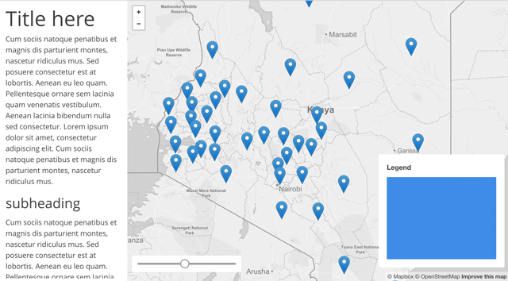

# Assignment 04: Implementing the User Experience

## Table of Contents

<!-- TOC -->

- [Assignment 04: Implementing the User Experience](#assignment-04-implementing-the-user-experience)
    - [Table of Contents](#table-of-contents)
    - [Part I: Data wrangling (1 pt)](#part-i-data-wrangling-1-pt)
    - [Part II: Building a layout to support functional requirements (6 pts)](#part-ii-building-a-layout-to-support-functional-requirements-6-pts)
        - [Adding UI and legend elements to our map](#adding-ui-and-legend-elements-to-our-map)
        - [Styling page elements](#styling-page-elements)
        - [Using Mapbox raster tiles in Leaflet](#using-mapbox-raster-tiles-in-leaflet)
        - [Loading data into the app using Omnivore](#loading-data-into-the-app-using-omnivore)
        - [Moving custom CSS and JS to external files.](#moving-custom-css-and-js-to-external-files)
    - [Part III: Create a mockup – version 1 (3 pts)](#part-iii-create-a-mockup--version-1-3-pts)
        - [Deliverable](#deliverable)

<!-- /TOC -->

## Part I: Data wrangling (1 pt)

Follow the [lesson section](../README.md#the-scope-plane-functional-specifications-and-content-requirements) on data wrangling to create the Kenya primary education enrollment data. Place this data in the assignment's *data* folder.

## Part II: Building a layout to support functional requirements (6 pts)

**Instructions:** Build your *index.html* and file/directory structure according to the instructions detailed below. Note that you'll have needed to produced the properly formatted *kenya_education_2014.csv* file per the lesson instructions and saved it within a *assignment/data/* directory. Note that this CSV needs to be well-formatted to work within the map solution that follows.

Before we get started coding our map or getting the data into the application, we want to start with a basic HTML boilerplate. This code isn't something we need to recall from memory or write from scratch. Instead, we often either keep a boilerplate ready, copy and paste the markup from a previous project, or grab it from an example on the web. While it's most efficient in terms of your workflow to keep a boilerplate handy, occasionally, you'll want to revisit this as advancements in the web specifications change (as the big shift from HTML4 to HTML5 several years ago).

We've used the Bootstrap framework to help us with the layout of our page.  As we know, this framework makes use of a "grid" layout, which helps organize and vertically align elements within the page, as well as to "responsively" adapt to the width of the page and elements within it to a given device (read more about [CSS Grid Layout](https://developer.mozilla.org/en-US/docs/Web/CSS/CSS_Grid_Layout)).

We're going to explore another framework for Modules 04 and 05: [Assembly CSS](https://www.mapbox.com/assembly/) (follow the link and have a look!). Assembly, written by folks working for Mapbox, is under current development and uses a new CSS module called "Flexbox." See:

* [Basic concepts of flexbox](https://developer.mozilla.org/en-US/docs/Web/CSS/CSS_Flexible_Box_Layout/Basic_Concepts_of_Flexbox)
* [A Complete Guide to Flexbox](https://css-tricks.com/snippets/css/a-guide-to-flexbox/)

We can consider Assembly CSS a somewhat lighter version of Bootstrap. While it offers a lot of support for layout (and includes JavaScript), it's not as full-featured as Bootstrap. A good place to begin with Assembly CSS is the ["Getting Started"](https://www.mapbox.com/assembly/) section from the documentation.

Create a new `index.html` file within your `assignment` directory, and begin with the following HTML template.

```html
<!DOCTYPE html>
<html>

<head>
  <meta charset=utf-8 />
  <title>MAP673 Assignment 04 Starter</title>
  <meta name='viewport' content='initial-scale=1,maximum-scale=1,user-scalable=no' />
  <link href="https://api.mapbox.com/mapbox-assembly/v0.24.0/assembly.min.css" rel="stylesheet">
  <style>
    /* custom CSS style rules written here*/
  </style>
</head>

<body>
  
  <script async defer src="https://api.mapbox.com/mapbox-assembly/v0.24.0/assembly.js"></script>
  <script>
    // custom JavaScript written here
  </script>
</body>

</html>
```

Within the body tags, write the following HTML, borrowed and modified from [this Assembly example](https://www.mapbox.com/assembly/examples/sidebar-apps/):

```html
<div class='flex-parent viewport-full relative scroll-hidden'>
  <div class='flex-child w-full w300-ml absolute static-ml left bottom'>
    <div class='flex-parent flex-parent--column viewport-third h-full-ml hmax-full bg-white py18 px12'>
      <div class='flex-child flex-child--grow px12 py12 scroll-auto'>
        <h1 class='txt-h1 mb6'>Title here</h1>
        <p>I love cheese, especially halloumi taleggio. Everyone loves stinking bishop camembert de normandie cut the cheese macaroni cheese mascarpone parmesan blue castello. Halloumi roquefort the big cheese cow cheesecake when the cheese comes out everybody's happy halloumi swiss. Caerphilly cream cheese cottage cheese red leicester halloumi cheesy feet airedale mozzarella. Fondue gouda fromage frais.</p>
        <h2 class='txt-xl mt18 mb12'>subheading</h2>
        <p>Parmesan caerphilly bocconcini. Dolcelatte red leicester babybel pepper jack danish fontina cut the cheese fromage frais cheese and wine. Cheese on toast chalk and cheese everyone loves jarlsberg cream cheese mozzarella halloumi boursin. Manchego danish fontina when the cheese comes out everybody's happy cut the cheese goat goat stinking bishop st. agur blue cheese. Fromage stinking bishop.</p>
      </div>
      <footer class='px12 py12 bg-gray-faint txt-s'>
        <ul>
          <li>Explore the raw
            <a class='link' href='#'>data</a>
          </li>
          <li>Map authored by
            <a class='link' href='#'>Ptolemeese</a>
          </li>
        </ul>
      </footer>
    </div>
  </div>
  <div class='flex-child flex-child--grow viewport-twothirds viewport-full-ml'>
    <div id="map" class='viewport-twothirds viewport-full-ml'></div>
  </div>
</div>
```

**Important:** This HTML can be a bit daunting to understand. What is noteworthy are paired element tags. If there is an opening `<div>` tag then there needs to be a closing `</div>` tag. Otherwise, the page may break and elements will not sit where you intend them. 

Your text editor can help with this. The [VS Code Editor has functionality](https://code.visualstudio.com/docs/languages/html) that will help with formatting indentions when saving the document. This capability helps you visually confirm that tags are closed and/or contain other elements within them. Extensions such as [Bracket Pair Colorizer](https://marketplace.visualstudio.com/items?itemName=CoenraadS.bracket-pair-colorizer) can help you recognize tag pairs.
 
For instance, the division element containing our map is wrapped within two other division tags:

```html
<div class='flex-parent viewport-full relative scroll-hidden'>
  <!-- Page content go here and exists next to the map -->
  <div class='flex-child flex-child--grow viewport-twothirds viewport-full-ml'>
    <div id="map" class='viewport-twothirds viewport-full-ml'></div>
    <!-- UI & legend go here and floats above map -->
  </div>
</div>
```

The first division tag contains all the page elements. The second division element contains only the map and elements that affect its action and interpretation. This layout technique helps group related page elements on different browser sizes.

### Adding UI and legend elements to our map

Let's now add: 1. a division element that can hold our legend, and 2. an input range slider for eventually sequencing through our data attributes, also wrapped in a division element. 

After the `map` element, add the HTML for both the `slider` and `legend` elements. 

```html
<!-- ui slider -->
<div id='slider' class='range w240 bg-white round-ml px12'>
  <input type="range" >
</div>

<!-- legend -->
<div id='legend' class='bg-white round-ml px18 py12'>
  <h3 class='txt-bold mb12 w-full mx-auto'>Legend Title</h3>
  <div class='bg-blue h180 w240 mx-auto'></div>
</div>
```

Note that we've included `id` properties and more Assembly CSS classes for basic formatting. We have no data yet, so we're merely creating a placeholder for the future proportional symbol legend.

### Styling page elements

We can select DOM elements and style them with custom CSS. Include some CSS in the `<style></style>` tag (and after you've loaded the assembly.min.css file). We can select the map element and provide a background color:

```html
<style>
  #map {
    background: #448ee4;
  }
</style>
```

Saving these changes and testing the file in your browser reveals a nicely formatted, scrollable side column at left, with some footer information at the bottom. To the right, we have a placeholder for our map, currently with a background color of blue (so we can visually see that it's there and filling the space). We also notice that the layout is relatively responsive:

  
*Basic one-column page layout with Assembly CSS.*

How does Assmembly.css work to apply style rules to these elements? You'll notice that most of the elements in the example have many class attribute values, separated by a space (e.g., `flex-child w-full w300-ml absolute static-ml left bottom`). Rather than writing all the CSS rules ourselves, we can rely on Assembly's many class definitions to help style the layout of the page, positioning of elements, typography, margin and padding around elements, and all the other aspects governed by CSS related to presentation.

Let's look at an example. Consider the h1 heading element: `<h1 class='txt-h1 mb6'>Title here</h1>`. There are two classes applied to this element, `txt-h1` and `mb6`. These aren't standard class names, but they were invented by the people who wrote Assembly CSS. To know what they are and how to modify them, we need to consult the [documentation](https://www.mapbox.com/assembly/documentation/) (you can Cntr+F to search for a specific class name within the docs, or search using the navigation).

  
*Assembly CSS documentation of Typography.*

We see that the `txt-h1` class is one of several classes for headings that include:

```css
.txt-h1 { }
.txt-h2 { }
.txt-h3 { }
.txt-h4 { }
.txt-h5 { }
```

Try changing the class `txt-h1` class on the h1 element to one of these other options to see the results in your browser.

Note that the documentation also links you directly to [the actual CSS rules in the assembly.css file that governs that style rule](https://github.com/mapbox/assembly/blob/dev-pages/src/typography.css#L146). You can see that these are nothing special: just CSS rules like `font-size: 45px;` and `line-height: 54px;`:

```css
.txt-h1 {
  font-size: 45px;
  line-height: 54px;
}
```

Within the documentation and the Assembly CSS stylesheet, we see we have additional rules to apply to text elements in our document (here using [custom CSS properties](https://developer.mozilla.org/en-US/docs/Web/CSS/Using_CSS_variables)):

```css
.txt-xl {
  font-size: var(--font-size-xl);
  line-height: var(--line-height-xl);
}

.txt-l {
  font-size: var(--font-size-l);
  line-height: var(--line-height-l);
}

.txt-m {
  font-size: var(--font-size-m);
  line-height: var(--line-height-m);
}

.txt-s {
  font-size: var(--font-size-s);
  line-height: var(--line-height-s);
}

.txt-xs {
  font-size: var(--font-size-xs);
  line-height: var(--line-height-xs);
}
```

The second class rule applied to our h1 heading is `mb6`, which isn't very helpful or descriptive. We again need to [dig into the documentation](https://www.mapbox.com/assembly/documentation/#Margins) to make sense of this class rule, which gives the element a bottom-margin of 6 pixels. The more you work with Assembly CSS, you'll learn to read the class rule `mb6` as margin - bottom - 6 pixels. To add a value of 6 pixels to the top margin, we'd write `mt6` and so forth.

These class names are not necessarily intuitive. The tradeoff of using a CSS framework such as Assembly CSS is that you must study and remember an abstract set of class names that are not necessarily intuitive and usually aren't applied to other frameworks. The benefit is, once you master the framework and apply it to a project, you'll like have a consistent display across browsers and devices and can develop more quickly than writing all your own rules.

Again, keep in mind that you can override the Assembly CSS rules with your own. Assembly is designed for this eventuality (you need to "assembly" your document yourself!). To do so, add our familiar `<style></style>` tags to the head of the document and write some custom CSS. For instance, we can still select the h1 header and try applying a `color` rule:

```html
<style>
  h1 {
      color: orange;
  }
</style>
```

Applying this rule results in:

  
*Overriding Assembly CSS rule with a custom CSS rule.*

We can see see the title is now orange. If we inspect the CSS inheritance in the web dev tools, our rule is now visible, but note how .mb6 and .txt\-h1 still override our h1 rule for their stated rules. Attempting to add a `font-size` rule to our h1 select will be overwritten by the Assembly CSS rule.

  
*Assembly CSS overriding custom rule of font-size.*

 You can sometimes override an Assembly CSS rule with `!important`, but many of Assembly's rules also use this to ensure the grid layout doesn't break inadvertently (so it should be avoided).

So far, we haven't armed this web page with the code needed to do our web mapping. Let's turn to that next, and get a basic slippy map loaded in the page.

### Using Mapbox raster tiles in Leaflet

First, let's practice building up a template/prototype map to begin loading data and testing our build. Add the HTML requesting the Leaflet CSS and JS files to the document:

```html
<!-- add to HEAD of document -->
<link rel="stylesheet" href="https://unpkg.com/leaflet@1.7.1/dist/leaflet.css"
  integrity="sha512-xodZBNTC5n17Xt2atTPuE1HxjVMSvLVW9ocqUKLsCC5CXdbqCmblAshOMAS6/keqq/sMZMZ19scR4PsZChSR7A=="
  crossorigin=""/>

<!-- add toward bottom of the document body -->
<script src="https://unpkg.com/leaflet@1.7.1/dist/leaflet.js"
  integrity="sha512-XQoYMqMTK8LvdxXYG3nZ448hOEQiglfqkJs1NOQV44cWnUrBc8PkAOcXy20w0vlaXaVUearIOBhiXZ5V3ynxwA=="
  crossorigin=""></script>
```

For this map, we will make use of raster tiles produced and hosted by the company Mapbox. You'll first need to create a free account with Mapbox (if you don't already have one) and obtain your API access token: https://www.mapbox.com/account/access-tokens.

Then, begin writing the JavaScript to create the Leaflet map and add the mapbox tiles to it: 

```javascript
// initialize map, centered on Kenya
  var map = L.map('map', {
    zoomSnap: .1,
    center: [-.23, 37.8],
    zoom: 7,
    minZoom: 6,
    maxZoom: 9,
    maxBounds: L.latLngBounds([-6.22, 27.72], [5.76, 47.83])
  });

// mapbox API access Token
  var accessToken = '<your access token here>'

// request a mapbox raster tile layer and add to map
  L.tileLayer(`https://api.tiles.mapbox.com/v4/{id}/{z}/{x}/{y}.png?access_token=${accessToken}`, {
    attribution: 'Map data &copy; <a href="http://openstreetmap.org">OpenStreetMap</a> contributors, <a href="http://creativecommons.org/licenses/by-sa/2.0/">CC-BY-SA</a>, Imagery © <a href="http://mapbox.com">Mapbox</a>',
    maxZoom: 18,
    id: 'mapbox.light',
    accessToken: accessToken
  }).addTo(map);
```

Save these changes and then test the file in your browser (using a local host server, of course).

  
*Web Page with Mapbox map loaded.*

The [Mapbox maps API offers a variety of basemaps](https://www.mapbox.com/api-documentation/#maps) for use within a Mapbox.js-enabled map. Feel free to play around with these other basemaps, although the light one is most suitable for thematic web mapping.

The basemap and its design are important considerations and one perhaps left until later in our process. Its design may be more within Garrett's surface plane in that it should complement the colors, typography, and tone of the overall web application. Fortunately, a different basemap can easily be swapped in later on.

Now that we have a basic working slippy map let's plot our Kenyan primary school data point data on the map.

### Loading data into the app using Omnivore

We've encoded the point-level schools data within a CSV file. As you remember, in a previous module, we used a JavaScript library named [PapaParse](http://papaparse.com/) to load the CSV data into our script asynchronously.

We can also use a plugin named [Leaflet Omnivore](https://www.mapbox.com/mapbox.js/plugins/#leaflet-omnivore), which loads and parses a variety of data formats and converts them into a Leaflet GeoJson layer. The plugin has its own [leaflet-omnivore](https://github.com/mapbox/leaflet-omnivore) GitHub repository with further documentation.

First, we need to include the plugin within our web page, and then can try implementing it using our `keyna_education_2014` data. At the bottom of our document, **after we load the Mapbox.js script**, let's load the Omnivore JS code.

```javascript
<script src='//api.tiles.mapbox.com/mapbox.js/plugins/leaflet-omnivore/v0.3.1/leaflet-omnivore.min.js'></script>
```

Then, drawing from the [Leaflet Omnivore example](https://www.mapbox.com/mapbox.js/example/v1.0.0/markers-from-csv/), we can first try loading the data and adding it to the map using the statement:

```javascript
omnivore.csv('data/kenya_education_2014.csv').addTo(map);
```

  
*CSV data loaded with Omnivore and added to map as Leaflet GeoJson layer.*

With the inclusion of this one statement, it appears we've successfully loaded the data and drawn them on the map as the default Leaflet markers! Omnivore handled the AJAX request for the file and parsed it as Leaflet GeoJson layers, and the method call `addTo(map)` plotted our data to the map as simple Leaflet markers.

However, if there happens to be an error in the CSV data or a problem parsing it, Omnivore doesn't, by default, throw us a useful error. As the documentation for the [Leaflet Omnivore](https://github.com/mapbox/leaflet-omnivore) warns us:

> Each function returns an `L.geoJson` object. Functions that load from URLs are asynchronous, so they will not immediately expose accurate `.setGeoJSON()` functions.
>
>For this reason, we fire events:  
> * `ready :` fired when all data is loaded into the layer
> * `error: ` fired if data can't be loaded or parsed

```javascript
var layer = omnivore.gpx('a.gpx')
.on('ready', function() {
    //  all data is loaded into the layer
})
.on('error', function() {
    // fired if the layer can't be loaded over AJAX
    // or can't be parsed
})
.addTo(map);
```
It's a good idea to use some error catching technique when you can, especially when dealing with asynchronous calls. Therefore, let's modify our script using this example.

```javascript
omnivore.csv('kenya_education_2014.csv')
    .on('ready', function(e) {
        console.log(e.target)
    })
    .on('error', function(e) {
        console.log(e.error[0].message);
});
```

Here we see that we're making use of the `e` parameter created within each callback function. In the case of the `.on('ready' .. )` method callback function, e.target will give us access to the resultant Leaflet GeoJson LayerGroup layer. The  `e` parameter created within `.on('error' .. )` method gives us access to any errors the script reports.

By using `console.log(e.target)` we have access to the Leaflet GeoJson LayerGroup, knowing that the data has been properly loaded and ready for further use within our script.


Next, we'll use some familiar Leaflet JavaScript methods to "get" or select these elements and add them to the map. Add the following JavaScript after the Omnivore call to load the data:

```javascript
// create Leaflet control for the legend
var legendControl = L.control({
  position: 'bottomright'
});

// when the control is added to the map
legendControl.onAdd = function (map) {

  // select the legend using id attribute of legend
  var legend = L.DomUtil.get("legend");

  // disable scroll and click functionality 
  L.DomEvent.disableScrollPropagation(legend);
  L.DomEvent.disableClickPropagation(legend);

  // return the selection
  return legend;

}

legendControl.addTo(map);

// do the same thing for the UI slider
var sliderControl = L.control({
    position: 'bottomleft'
});

sliderControl.onAdd = function(map) {

  var controls = L.DomUtil.get("slider");

  L.DomEvent.disableScrollPropagation(controls);
  L.DomEvent.disableClickPropagation(controls);

  return controls;

}

sliderControl.addTo(map);
```

This code creates L.Control objects, selects our respective HTML elements, and adds them to the map (disabling scrolling or clicking on the map underneath them). Because we have applied some Assembly CSS classes to these HTML elements, they should look OK initially. We can refine them with custom CSS in the next module.

  
*HTML elements added to the map as L.Controls.*

We now have a responsive layout for our web page and are loading data into the map!

### Moving custom CSS and JS to external files.

To wrap up, we'll make some modifications to our file/directory structure. It's often convenient to start development with the CSS, HTML, and JS all within the *index.html* file. We've been doing this so far in New Maps Plus; we write our CSS rules within the head of the document between the `<style></style>` tags and the JS at the bottom between the `<script></script>` tags.

However, at some point, before you release the productive version of the document, you'll want to move these to external files. You've likely noticed that we're starting to keep data files in a directory called *data/* and link to these files using a relative path (e.g., `data/kenya_education_2014.csv`). We'll do the same for our CSS and JS now.

To do this, create two new directories within the *assingment/* directory and name them *js/* and *css/*. Then, create a file named *app.js* within the *js/* directory and a file named *styles.css* within the *css/* directory.

Open the *app.js* file in your text editor and begin by writing the following JS within the blank file:

```javascript
(function(){

    // application code goes here

})();
```

This is an anonymous, self-invoking function that will execute once the document has loaded and all the resources are available.

Next, cut and paste all the JS we've written so far from the *index.html* file and paste it into the body of this function. Then, give the now empty script tags a `src` attribute value of a relative path to the new file: `<script src='js/app.js'></script>`. Save the files and test in the browser to ensure the paths are correct and the page loads as before.

While we haven't written much custom CSS, other than testing to see if we can change the title to orange, we can do the same thing with our CSS file. Link to this local file in the same way as we request and load the other external resources: `<link href='css/styles.css' rel='stylesheet' />.` You can now remove the empty `<style></style>` and `<script></script>` tags from the document.

Your final file/directory structure should then look like this:

```text
- assingment/
  - index.html
  - css/
    - styles.css
  - js/
    - app.js
  - data/
    - kenya_education_2014.csv
  - graphics/ (images used in the README.md file)
  - README.md (the assignment instructions)
  - mockup.png (from part III below)
```

## Part III: Create a mockup – version 1 (3 pts)

Begin by reading ["Chapter Four: Form and Magic"](https://shapeofdesignbook.com/chapters/04-form-and-magic/) from Frank Chimero's _The Shape of Design_. Within this chapter Chimero asserts that successful design incorporates three elements:

> All design work seems to have three common traits: there is a message to the work, the tone of that message, and the format that the work takes. Successful design has all three elements working in co-dependence to achieve a whole greater than the sum of the individual parts.

Then, imagine a map web page you'd like to create. Perhaps this is the start to your final project in this course. What *message* do you want to send into the world? This can be as general or specific as you want. Don't worry about data sources yet (though it would be good to have a *reasonably good* chance that you can get the data). Sketch out your page and show where the content and UI components are placed (its *format*). Think about typefaces, colors, and graphics (its *tone*) that complement your page's topic (its *message*). We'll create a second, more detailed, version in the next module.

As you create your design, reflect on the following two questions. 
    
1. What do you want to get out of this product?
2. What do your users want to get out of it?

For example, I might want to make a map to explore a new tool and show how to overlay two map layers and swipe between them. That's my motivation; I want to learn a new technique. While I want my user to identify exact locations on a one-hundred-year-old map and compare it the current conditions. Of course, all mapmakers can be map users, so double bonus!

This idea may or may not end up being your final project idea for this class, but start thinking of one. Either way, have fun playing with it for now. 

### Deliverable

Create a low-fidelity wireframe or mockup of this map and web page. Feel free to draw by hand and scan or take a picture of, or use a computer or web-based application, to produce a digital image of this wireframe/mockup. Save this image as a PNG or JPG in your *assignment* folder.

